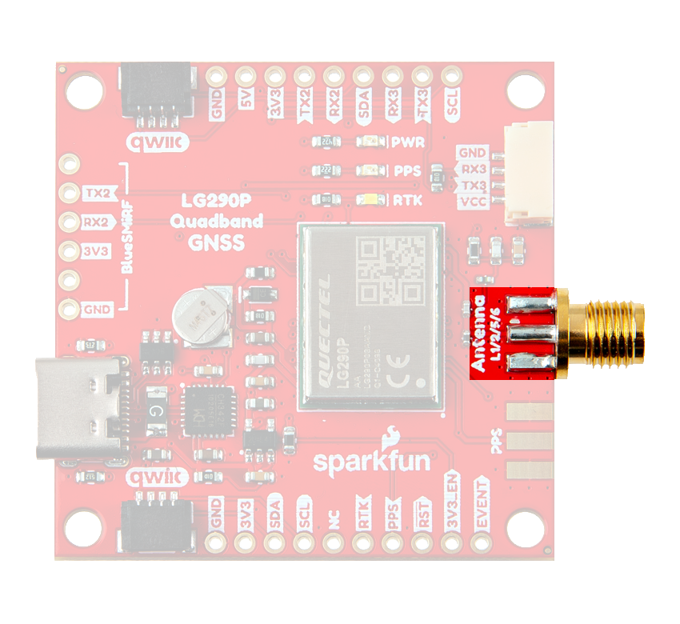

## :material-folder-cog: Design Files
The SparkFun LG290P Quadband GNSS RTK breakout board's dimensions, pin layout, and connectors are exactly the same as our vary popular [SparkFun GPS-RTK-SMA Breakout - ZED-F9P (Qwiic)](https://www.sparkfun.com/products/16481); and can be used as a drop-in replacement. The board features three UART ports, which are accessible through the USB-C connector, BlueSMiRF *(6-pin PTH)* header , and 4-pin locking JST connector.  Users can also interface with the board through the 24 PTH pins that are broken out around the edge of the board. For the GNSS antenna, an SMA antenna connector is provided on the edge of the board; additionally, there are also SMD pads for another *(RP-)*SMA connector to output a PPS signal.  We also provide two 4-pin JST Qwiic connectors for future use, when the I2</cup> feature becomes available for the GNSS module.

<!-- Import the component -->

- :kicad-logo:{ .enlarge-logo } Design Files

	---

	- :fontawesome-solid-file-pdf: [Schematic](./assets/board_files/schematic.pdf)
	- :material-folder-zip: [KiCad Files](./assets/board_files/kicad_files.zip)
	- :material-cube-outline: [STEP File](./assets/3d_model/cad_model.step)
	- :fontawesome-solid-file-pdf: [Board Dimensions](./assets/board_files/dimensions.pdf):
		- 1.70" x 1.70" (43.2mm x 43.2mm)
		- Four mounting holes:
			- 4-40 screw compatible

-	  

	<model-viewer src="../assets/3d_model/web_model.glb" camera-controls poster="../assets/3d_model/poster.png" tone-mapping="neutral" shadow-intensity="1.49" exposure="0.75" shadow-softness="0.58" camera-target="-0.001m 0m 0m" camera-orbit="0deg 70deg 0.1259m" field-of-view="25.11deg" environment-image="legacy" style="width: 100%; height: 450px;">
	</model-viewer>
	

## USB-C Connector
The USB connector is provided to power and communicate with the LG290P GNSS receiver. For most users, it will be the primary method for interfacing with the LG290P.

<figure markdown>
[{ width="400" }](./assets/img/hookup_guide/usb_connector.png "Click to enlarge")
<figcaption markdown>
USB-C connector on the Quad-band GNSS RTK breakout board.
</figcaption>
</figure>

### CH342 Dual UART Converter
The CH342 serial-to-USB converter allows users to interface with the `UART1` port of the LG290P GNSS module through the USB-C connector. Although the CH342 provides a dual-channel UART interface, only a single channel is utilized to communicate with the LG290P GNSS module. To utilize the CH342, users may need to install a USB driver, which can be downloaded from the [manufacturer website](https://www.wch-ic.com/search?q=CH342&t=downloads).

Once the USB driver is installed:

- Two virtual `COM` ports will be emulated, which can be used as standard `COM` ports to access the receiver.
- Users should select `COM` port with the lower enumeration or the one labeled as `Channel A`.

??? tip "Tip - USB Drivers"
	

	-   :material-microsoft-windows: **Windows**

		---

		[:octicons-download-16:{ .heart } Download Page for <code>CH343SER.EXE</code>](https://www.wch-ic.com/downloads/CH343SER_EXE.html){ .md-button .md-button--primary target="blank" }

	-   :material-apple: **MacOS**

		---

		[:octicons-download-16:{ .heart } Download Page for `CH341SER_MAC.ZIP`](https://www.wch-ic.com/downloads/CH34XSER_MAC_ZIP.html){ .md-button .md-button--primary target="blank" }

	

	!!! info "Linux"
		A USB driver is not required for Linux based operating systems.

## Power
The Quad-band GNSS RTK breakout board only requires **3.3V** to power the board's primary components. The simplest method to power the board is through the USB-C connector. Alternatively, the board can also be powered through the other connectors and [PTH](https://en.wikipedia.org/wiki/Through-hole_technology "Plated Through Holes") pins.

<figure markdown>
[{ width="400" }](./assets/img/hookup_guide/power_connections.png "Click to enlarge")
<figcaption markdown>
Quad-band GNSS RTK breakout board's power connections.
</figcaption>
</figure>

Below, is a general summary of the power circuitry for the board:

- **`5V`** - The voltage from the USB-C connector, usually **5V**.
	- Can be utilized as the primary power source for the entire board.
- **`3V3`** - 3.3V power rail, which powers the LG290P GNSS module, backup battery, and the power LED.
	- Power can also be distributed to/from any of the `3V3` PTH pins or JST connectors *(Qwiic or `UART3`)*.
		- For power that is supplied through these connections, the LG290P requires a supply voltage of **3.15–3.45V**.
	- A regulated **3.3V** is supplied by the [RT9080](./assets/component_documentation/DS9080.pdf), when powered from the `5V` PTH pin or USB connector
		- Input Voltage Range: **3.0 to 5.5V**
		- The RT9080 LDO regulator can source up to 600mA.
- **`3V3_EN`** - Controls the power output form the RT9080 voltage regulator.
	- By default, the pin is pulled-up to 5V and to enable the RT9080 output voltage.
- **`GND`** - The common ground or the 0V reference for the voltage supplies.

!!! info
	For more details, users can reference the [schematic](./assets/board_files/schematic.pdf) and the datasheets of the individual components on the board.

-   ### Power Consumption

	The power consumption of the LG290P GNSS module depends on the GNSS signals enabled and the positioning mode.

	**Current Consumption:**

	- Acquisition: 91mA (300.3mW)
	- Tracking: 91mA (300.3mW)
	- Backup Mode: 12μA (39.6mW)

-   ### Backup Battery

	While charged, the backup battery allows the GNSS module to hot/warm start with valid ephemeris data (time and GNSS orbital trajectories) that was stored.

	**Time to First Fix:**

	- Cold Start: 28s
	- Warm Start: 28s
	- Hot Start: 1.7s

## :fontawesome-solid-microchip:&nbsp; LG290P GNSS
The centerpiece of the Quad-band GNSS RTK breakout board, is the [LG290P GNSS module](./assets/component_documentation/Quectel_LG290P(03)_Hardware_Design_V1.0.pdf) from [Quectel](https://www.quectel.com/). The LG290P is a low-power, multi-band, multi-constellation GNSS receiver capable of delivering centimeter-level precision at high update rates. The built-in NIC anti-jamming unit provides professional-grade interference signal detection and elimination algorithms, which effectively mitigate against multiple narrow-band interference sources and significantly improves the signal reception performance in complex electromagnetic environments. With its performance advantages of high-precision and power consumption, this board is an ideal choice for high-precision navigation applications, such as intelligent robots, UAVs, precision agriculture, mining, surveying, and autonomous navigation.

<figure markdown>
[{ width="300" }](./assets/img/hookup_guide/LG290P.png "Click to enlarge")
<figcaption markdown>
The LG290P module on the Quad-band GNSS RTK breakout board.
</figcaption>
</figure>

{ .qr width=100 }
<article class="video-500px">
<iframe src="https://player.vimeo.com/video/1000742664?dnt=1&amp;app_id=122963" title="Quectel: Product Intro for LG290P GNSS Module" frameborder="0" allow="accelerometer; autoplay; clipboard-write; encrypted-media; gyroscope; picture-in-picture" allowfullscreen></iframe>
</article>

??? info "General Features"
	

	

	- Supply Voltage: **3.15–3.45V**
	- Tracking Channels: 1040
	- Concurrent signal reception: 5 + QZSS
		- `L1`, `L2`, `L5`, `E6` frequency bands
	- Sensitivity:
		- Acquisition: -146dBm
		- Tracking: -160dBm
		- Reacquisition: -155dBm
	- Antenna Power: External or Internal
	- GNSS Constellations and SBAS Systems:
		- **USA:** GPS + WASS
		- **Russia:** GLONASS + SDCM
		- **EU:** Galileo + EGNOS
		- **China:** BDS + BDSDAS
		- **Japan:** QZSS + MSAS
		- **India:** NavIC + GAGAN
	- Accuracy of 1PPS Signal: 5ns *(RMS)*
	- Update Rate:
		- Default: 10Hz
		- Max: 20Hz

	

	

	- Time to First Fix *(without AGNSS)*:
		- Cold Start: 28s
		- Warm Start: 28s
		- Hot Start: 1.7s
	- RTK Convergence Time: 5s
	- Dynamic Performance:
		- Maximum Altitude: 10000m
		- Maximum Velocity: 490m/s
		- Maximum Acceleration: 4g
	- Built-in NIC anti-jamming unit
	- Interfaces
		- UART (x3)
			- Baud Rate: 9600–3000000bps
				- **Default:** 460800bps
			- Protocol: `NMEA 0183`/`RTCM 3.x`
		- SPI[^1] (x1)
		- I^2^C[^1] (x1)
	- Operating temperature: -40&deg;C to +85&deg;C
	- Footprint: 12.2mm × 16mm × 2.6mm
	- Weight: ~0.9g

	

	

	[^1]:
		!!! warning "Feature Under Development"
			Currently, only the UART interface is supported by the module. Support for the **I^2^C** and **SPI** interfaces are still under development.

??? info "Supported Frequency Bands"
	The LG290P modules are multi-band, multi-constellation GNSS receivers. Below, is a chart illustrating the frequency bands utilized by all the global navigation satellite systems; along with a list of the frequency bands and GNSS systems supported by the LG290P GNSS module.

	<figure markdown>
	[{ width="800" style="background-color:white"}](https://www.tallysman.com/app/uploads/2021/07/Tallysman-GNSS-Frequencies-v8.0_Chart-1-1024x425.png "Click to enlarge")
	<figcaption markdown>
	Frequency bands of the global navigation satellite systems. (Source: [Tallysman](https://www.tallysman.com/gnss-constellations-radio-frequencies-and-signals/))
	</figcaption>
	</figure>

	

	

	**Supported Frequency Bands:**

	- GPS: `L1 C/A`, `L1C`[^2], `L5`, `L2C`
	- GLONASS: `L1`, `L2`
	- Galileo: `E1`, `E5a`, `E5b`, `E6`
	- BDS: `B1I`, `B1C`, `B2a`, `B2b`, `B2I`, `B3I`
	- QZSS: `L1 C/A`, `L1C`[^2], `L5`, `L2C`
	- NavIC: `L5`
	- SBAS: `L1 C/A`
	- L-band PPP[^3]:
		- PPP: `B2b`
		- QZSS: `L6`
		- Galileo HAS: `E6`

	

	

	**Supported GNSS Constellations:**

	- GPS (USA)
	- GLONASS (Russia)
	- Galileo (EU)
	- BDS (China)
	- QZSS (Japan)
	- NavIC (India)

	**Supported SBAS Systems:**

	- WASS (USA)
	- SDCM (Russia)
	- EGNOS (EU)
	- BDSBAS (China)
	- MSAS (Japan)
	- GAGAN (India)

	

	

	[^2]:
		!!! warning "Feature Under Development"
			Support for the `L1C` frequency band has not been implemented.
	[^3]:
		!!! warning "Feature Under Development"
			Corrections for some of the PPP services have not been implemented.

	!!! info
		For a comparison of the frequency bands supported by the LG290P GNSS modules, refer to sections **1.2**, **1.5**, and **1.6** of the [hardware design manual](./assets/component_documentation/Quectel_LG290P(03)_Hardware_Design_V1.0.pdf).

	??? tip "What are Frequency Bands?"
		A [frequency band](https://en.wikipedia.org/wiki/Frequency_band) is a section of the [electromagnetic spectrum](https://en.wikipedia.org/wiki/Electromagnetic_spectrum), usually denoted by the range of its upper and lower limits. In the [radio spectrum](https://en.wikipedia.org/wiki/Radio_spectrum), these frequency bands are usually regulated by region, often through a government entity. This regulation prevents the interference of RF communication; and often includes major penalties for any interference with critical infrastructure systems and emergency services.

		<figure markdown>
		[{ width="400" }](https://gssc.esa.int/navipedia/images/c/cf/GNSS_All_Signals.png "Click to enlarge")
		<figcaption markdown>
		Frequency bands of the global navigation satellite systems. (Source: [ESA](https://gssc.esa.int/navipedia/index.php?title=File:GNSS_All_Signals.png "European Space Agency"))
		</figcaption>
		</figure>

		However, if the various GNSS constellations share similar frequency bands, then how do they avoid interfering with one another? Without going too far into detail, the image above helps illustrate some of the characteristics, specific to the frequency bands of each system. With these characteristics in mind, along with other factors, the chart can help users to visualize how multiple GNSS constellations might co-exist with each other.

		For more information, users may find these articles of interest:

		- [GNSS signal](https://gssc.esa.int/navipedia/index.php/GNSS_signal)
		- [GPS Signal Plan](https://gssc.esa.int/navipedia/index.php?title=GPS_Signal_Plan)
		- [GLONASS Signal Plan](https://gssc.esa.int/navipedia/index.php?title=GLONASS_Signal_Plan)
		- [GALILEO Signal Plan](https://gssc.esa.int/navipedia/index.php?title=GALILEO_Signal_Plan)

??? tip "GNSS Accuracy"
	The accuracy of the position reported from the LG290P GNSS module, can be improved based upon the correction method being employed. Currently, [RTK](https://en.wikipedia.org/wiki/	Real-time_kinematic_positioning "Real-Time Kinematic") corrections provide the highest level of accuracy; however, users should be aware of certain limitations of the system:

	- RTK technique requires real-time correction data from a reference station or network of base stations.
		- RTK corrections usually come from RTCM messages that are signal specific *(i.e. an RTK network may only provide corrections for specific signals; only `E5b` and not `E5a`)*.
	- The range of the base stations will vary based upon the method used to transmit the correction data.
	- The reliability of RTK corrections are inherently reduced in [multipath environments](https://en.wikipedia.org/wiki/Multipath_propagation).

	

	| Correction Method                                                                             | Horizontal                   | Vertical                | Velocity                                |
	| :-------------------------------------------------------------------------------------------- | :--------------------------: | :---------------------: | :-------------------------------------: |
	| Standalone                                                                                    | 0.7m ~2.3'                | 2.5m ~8.2'           | 3cm/s (0.108kph) ~1.2in/s (0.067mph) |
	| [RTK](https://en.wikipedia.org/wiki/Real-time_kinematic_positioning "Real-Time Kinematic")    | **0.8cm** *(+1ppm)* ~0.3" | 1.5cm *(+1ppm)* ~.6" |                                         |

	

	??? info "RTK Corrections"
		To understand how RTK works, users will need a more fundamental understanding of the signal error sources.

		

		-   <a href="https://www.sparkfun.com/news/7533">
			<figure markdown>
			
			</figure>

			---

			**Real-Time Kinematics Explained**</a>

		-   <a href="https://www.sparkfun.com/news/7138">
			<figure markdown>
			
			</figure>

			---

			**What is Correction Data?**</a>

		-   <a href="https://www.septentrio.com/en/learn-more/insights/gnss-corrections-demystified">
			<figure markdown>
			
			</figure>

			---

			**GNSS Corrections Demystified**</a>

		

### Peripherals and I/O Pins
The LG290P GNSS features several peripheral interfaces and I/O pins. Some of these are broken out as pins on the Quad-band GNSS RTK breakout board; whereas, others are broken out to their specific interface *(i.e. USB connector, JST connector, etc.)*. Additionally, some of their connections are tied to other components on the board.

<figure markdown>
[{ width="400" }](./assets/img/hookup_guide/peripherals1.png "Click to enlarge")
<figcaption markdown>
The peripheral interfaces and I/O pins on the Quad-band GNSS RTK breakout board.
</figcaption>
</figure>

**Interfaces:**

- UART (x3)
- ~~SPI[^1]~~
- ~~I^2^C[^1]~~
- ~~Event Trigger[^4]~~
- Timing Signal
- RTK Signal
- Module Reset

[^4]:
	!!! warning "Feature Under Development"
		The event trigger has not been implemented.

=== "UARTs"
	The LG290P GNSS has three UART ports, which can be operated and configured separately.

	

	

	<figure markdown>
	[{ width="400" }](./assets/img/hookup_guide/uart_ports.png "Click to enlarge")
	<figcaption markdown>
	The UART ports on the Quad-band GNSS RTK breakout board.
	</figcaption>
	</figure>

	

	

	!!! info "Default Configuration"
		By default, the UART ports are configured with the following settings: 

		- Logic Level: **3.3V**
		- Baudrate: **460800bps**
		- Data Bits: 8
		- Parity: No
		- Stop Bits: 1
		- Flow Control: None
		- Protocols:
			- `NMEA 0183`
			- `RTCM 3.x`

	??? tip "Pin Connections"
		When connecting to the board's UART pins to another device, the pins should be connected based upon the flow of their data.

		

		<table>
		<tr>
		<th>Board</th>
		<td align="center">RX</td>
		<td align="center">TX</td>
		<td align="center">GND</td>
		</tr>
		<tr>
		<th>UART Device</th>
		<td align="center">TX</td>
		<td align="center">RX</td>
		<td align="center">GND</td>
		</tr>
		</table>

		

	

	

	=== "`UART1`"
		

		`UART1` can only be accessed from the USB-C connector, through the CH342 serial-to-USB converter. For Windows and MacOS computers (1), a [USB driver must be installed](#ch342-dual-uart-converter) in order to communicate with the LG290P module through the CH342 converter. Once the USB driver is installed:

		- Two virtual `COM` ports are emulated, which can be used as standard `COM` ports to access the receiver.
		- Users should select `COM` port with the lower enumeration or listed as `Channel A`.

		

		1. On Linux, the standard Linux CDC-ACM driver is suitable.

	=== "`UART2`"
		`UART2` is available through the breakout [PTH](https://en.wikipedia.org/wiki/Through-hole_technology "Plated Through Holes") pins or the *BlueSMiRF header* pins. The pin layout of the BlueSMiRF header is pin compatible with many of our serial devices (i.e. [UART adapters](https://www.sparkfun.com/categories/349), [*serial* data loggers](https://www.sparkfun.com/categories/589), [BlueSMiRF transceivers](https://www.sparkfun.com/categories/tags/bluesmirf)).

	=== "`UART3`"
		`UART3` is available through the breakout [PTH](https://en.wikipedia.org/wiki/Through-hole_technology "Plated Through Holes") pins or the locking JST connector. The pin layout of the 4-pin locking JST connector is compatible with many of our [serial radios and adapter cables](../hardware_assembly/#radio-transceivers).

	??? info "UART Protocols"
		#### UART Protocols
		By default, the UART ports are configured to transmit and receive `NMEA 0183` and/or `RTCM 3.x` messages. These messages are generally used for transmitting PNT data; and providing or receiving RTK corrections, respectively. Quectel also implements a system of proprietary messages (`PQTM`) for users to configure the LG290P, following the data format of the `NMEA` protocol. The expected structure of these proprietary messages is shown below:

		<figure markdown>
		[{ width="600" }](./assets/img/hookup_guide/nmea_protocol.png "Click to enlarge")
		<figcaption markdown>
		The data structure of Quectel messages for the `NMEA` protocol.
		</figcaption>
		</figure>

		=== "NMEA"
			A full list of compatible `NMEA 0183` v4.11 messages, is provided in section **2.2. Standard Messages** of the [GNSS Protocol 	Specification](./assets/component_documentation/Quectel_LG290P_GNSS_Protocol_Specification_v1-0.pdf) manual. This protocol is 	used for outputting GNSS data, as detailed by the [National Marine Electronics Association](https://www.nmea.org/) organization.

			??? abstract "List of Standard NMEA Messages"
				

				| Message | Type Mode | Message Description               |
				| :-----: | :-------: | :-------------------------------- |
				| RMC | Output | Recommended Minimum Specific GNSS Data   |
				| GGA | Output | Global Positioning System Fix Data       |
				| GSV | Output | GNSS Satellites in View                  |
				| GSA | Output | GNSS DOP and Active Satellites           |
				| VTG | Output | Course Over Ground & Ground Speed        |
				| GLL | Output | Geographic Position – Latitude/Longitude |

				

		=== "PQTM"
			A full list of PQTM messages (proprietary NMEA messages defined by Quectel) supported by LG290P, is provided in section **2.3. 	PQTM Messages** of the [GNSS Protocol Specification](./assets/component_documentation/Quectel_LG290P_GNSS_Protocol_Specification_v1-0.pdf) manual. This protocol is used to configure or read the settings for the 	LG290P GNSS module.

			??? abstract "List of Proprietary Quectel Messages"
				

				| Message            | Type Mode    | Message Description                              |
				| :----------------- | :----------: | :----------------------------------------------- |
				| PQTMVER            | Output       | Outputs the firmware version                     |
				| PQTMCOLD           | Input        | Performs a cold start                            |
				| PQTMWARM           | Input        | Performs a warm start                            |
				| PQTMHOT            | Input        | Performs a hot start                             |
				| PQTMSRR            | Input        | Performs a system reset and reboots the receiver |
				| PQTMUNIQID         | Output       | Queries the module unique ID                     |
				| PQTMSAVEPAR        | Input        | Saves the configurations into NVM                |
				| PQTMRESTOREPAR     | Input        | Restores the parameters configured by all commands to their default values |
				| PQTMVERNO          | Output       | Queries the firmware version                     |
				| PQTMCFGUART        | Input/Output | Sets/gets the UART interface                     |
				| PQTMCFGPPS         | Input/Output | Sets/gets the PPS feature                        |
				| PQTMCFGPROT        | Input/Output | Sets/gets the input and output protocol for a specified port |
				| PQTMCFGNMEADP      | Input/Output | Sets/gets the decimal places of standard NMEA messages |
				| PQTMEPE            | Output       | Outputs the estimated position error             |
				| PQTMCFGMSGRATE     | Input/Output | Sets/gets the message output rate on the current interface |
				| PQTMVEL            | Output       | Outputs the velocity information                 |
				| PQTMCFGGEOFENCE    | Input/Output | Sets/gets geofence feature                       |
				| PQTMGEOFENCESTATUS | Output       | Outputs the geofence status                      |
				| PQTMGNSSSTART      | Input        | Starts GNSS engine                               |
				| PQTMGNSSSTOP       | Input        | Stops GNSS engine                                |
				| PQTMTXT            | Output       | Outputs short text messages                      |
				| PQTMCFGSVIN        | Input/Output | Sets/gets the Survey-in feature                  |
				| PQTMSVINSTATUS     | Output       | Outputs the Survey-in status                     |
				| PQTMPVT            | Output       | Outputs the PVT (GNSS only) result               |
				| PQTMCFGRCVRMODE    | Input/Output | Sets/gets the receiver working mode              |
				| PQTMDEBUGON        | Input        | Enables debug log output                         |
				| PQTMDEBUGOFF       | Input        | Disables debug log output                        |
				| PQTMCFGFIXRATE     | Input/Output | Sets/gets the fix interval                       |
				| PQTMCFGRTK         | Input/Output | Sets/gets the RTK mode                           |
				| PQTMCFGCNST        | Input/Output | Sets/gets the constellation configuration        |
				| PQTMDOP            | Output       | Outputs dilution of precision                    |
				| PQTMPL             | Output       | Outputs protection level information             |
				| PQTMCFGODO         | Input/Output | Sets/gets the odometer feature                   |
				| PQTMRESETODO       | Input        | Resets the accumulated distance recorded by the odometer |
				| PQTMODO            | Output       | Outputs the odometer information                 |
				| PQTMCFGSIGNAL      | Input/Output | Sets/gets GNSS signal mask                       |
				| PQTMCFGSAT         | Input/Output | Sets/gets GNSS satellite mask                    |
				| PQTMCFGRSID        | Input/Output | Sets/gets the reference station ID               |
				| PQTMCFGRTCM        | Input/Output | Sets/gets RTCM                                   |

				

		=== "RTCM"
			A full list of compatible `RTCM v3` messages, is provided in section **3. RTCM Protocol** of the [GNSS Protocol Specification](./	assets/component_documentation/Quectel_LG290P_GNSS_Protocol_Specification_v1-0.pdf) manual. This protocol is used for 	transferring GNSS raw measurement data, as detailed by the [Radio Technical Commission for Maritime Services](https://www.rtcm.	org/) organization.

			??? abstract "List of Supported RTCMv3 *(MSM)* Messages"
				

				| Message | Type Mode | Message Description                              |
				| :--: | :----------: | :----------------------------------------------- |
				| 1005 | Input/Output | Stationary RTK Reference Station ARP             |
				| 1006 | Input/Output | Stationary RTK Reference Station ARP with height |
				| 1019 | Input/Output | GPS Ephemerides                                  |
				| 1020 | Input/Output | GLONASS Ephemerides                              |
				| 1041 | Input/Output | NavIC/IRNSS Ephemerides                          |
				| 1042 | Input/Output | BDS Satellite Ephemeris Data                     |
				| 1044 | Input/Output | QZSS Ephemerides                                 |
				| 1046 | Input/Output | Galileo I/NAV Satellite Ephemeris Data           |
				| 1073 | Input/Output | GPS MSM3 |
				| 1074 | Input/Output | GPS MSM4 |
				| 1075 | Input/Output | GPS MSM5 |
				| 1076 | Input/Output | GPS MSM6 |
				| 1077 | Input/Output | GPS MSM7 |
				| 1083 | Input/Output | GLONASS MSM3 |
				| 1084 | Input/Output | GLONASS MSM4 |
				| 1085 | Input/Output | GLONASS MSM5 |
				| 1086 | Input/Output | GLONASS MSM6 |
				| 1087 | Input/Output | GLONASS MSM7 |
				| 1093 | Input/Output | Galileo MSM3 |
				| 1094 | Input/Output | Galileo MSM4 |
				| 1095 | Input/Output | Galileo MSM5 |
				| 1096 | Input/Output | Galileo MSM6 |
				| 1097 | Input/Output | Galileo MSM7 |
				| 1113 | Input/Output | QZSS MSM3 |
				| 1114 | Input/Output | QZSS MSM4 |
				| 1115 | Input/Output | QZSS MSM5 |
				| 1116 | Input/Output | QZSS MSM6 |
				| 1117 | Input/Output | QZSS MSM7 |
				| 1123 | Input/Output | BDS MSM3 |
				| 1124 | Input/Output | BDS MSM4 |
				| 1125 | Input/Output | BDS MSM5 |
				| 1126 | Input/Output | BDS MSM6 |
				| 1127 | Input/Output | BDS MSM7 |
				| 1133 | Input/Output | NavIC/IRNSS MSM3 |
				| 1134 | Input/Output | NavIC/IRNSS MSM4 |
				| 1135 | Input/Output | NavIC/IRNSS MSM5 |
				| 1136 | Input/Output | NavIC/IRNSS MSM6 |
				| 1137 | Input/Output | NavIC/IRNSS MSM7 |

				

=== "PPS Output"
	From the module, the [PPS](https://en.wikipedia.org/wiki/Pulse-per-second_signal "Pulse Per Second") output signal is a 3.3V signal output that can be access through the SMA connector and/or the `PPS` [PTH](https://en.wikipedia.org/wiki/Through-hole_technology "Plated Through Holes") pin. The signal is also connected to the `PPS` LED, which can be used as a visual indicator for its operation.

	<figure markdown>
	[{ width="400" }](./assets/img/hookup_guide/pps_signal.png "Click to enlarge")
	<figcaption markdown>
	The timing signal's outputs on the Tri-band GNSS RTK breakout board.
	</figcaption>
	</figure>

	??? tip "Jumpers"
		*See the **[Jumpers](#jumpers)** section for more details.*

		- There is a jumper attached to the `PPS` PTH pin. When cut, it disconnects the pin from the PPS signal.
		- There is a jumper attached to the `PPS` LED. For low power applications, the jumper can be cut to disable the `PPS` LED.

	??? tip "Use Case"
		- Users could use this signal in conjunction with the event pins to synchronize two modules with each other.
		- Users could use this signal to create their own **Stratum 0** source for the [NTP](https://en.wikipedia.org/wiki/Network_Time_Protocol "Network Time Protocol") on a primary time server.

=== "RTK"
	The `RTK` [PTH](https://en.wikipedia.org/wiki/Through-hole_technology "Plated Through Holes") pin operates as both the `RTK_STAT` status indicator for the RTK positioning and `ANT_ON` power control for the external LNA or active antenna power. The pin is also connected to the `RTK` LED, which can be used as a visual indicator for its operation.

	<figure markdown>
	[{ width="400" }](./assets/img/hookup_guide/pin-rtk2.png "Click to enlarge")
	<figcaption markdown>
	The RTK signal's outputs on the Tri-band GNSS RTK breakout board.
	</figcaption>
	</figure>

	=== "`RTK_STAT`"
		In this configuration, the pin is set to a high level at startup.

		1. If the pin output is high, it indicates the module has entered the RTK fixed mode.
		2. If the pin output is low, it indicates that the module exited the RTK fixed mode.
		3. If the pin outputs an alternating pin level, it indicates that the module received the correct RTCM data and did not enter the RTK fixed mode.

	=== "`ANT_ON`"
		In this configuration, the pin is used to control the external LNA or active antenna power supply.

		- When the pin is high, the antenna is powered.
		- When the pin is low, the antenna is not powered.

	??? tip "Jumpers"
		*See the **[Jumpers](#jumpers)** section for more details.*

		- There is a jumper attached to the `RTK` LED. For low power applications, the jumper can be cut to disable the `RTK` LED.

=== "Reset"
	The `RST` pin can be used to reset the LG290P module if it enters an abnormal state. To reset the GNSS module, the pin must be low for more than 100ms.

	<figure markdown>
	[{ width="400" }](./assets/img/hookup_guide/reset.png "Click to enlarge")
	<figcaption markdown>
	The `RST` pin on the Tri-band GNSS RTK breakout board.
	</figcaption>
	</figure>

<!-- === "Event" -->
<!-- === "I2C" -->

## SMA Connectors
While there are two SMD pads for SMA connectors, only the antenna's SMA connector is populated on the Quad-band GNSS RTK breakout board. The `Antenna` `L1/2/5/6` connector is an input for the GNSS antenna. Whereas, the `PPS` SMD pad provides a output for the **[PPS timing signal](#pps-output)**.

<figure markdown>
[{ width="400" }](./assets/img/hookup_guide/sma-antenna.png "Click to enlarge")
<figcaption markdown>
The SMA connector for an external GNSS antenna on the Quad-band GNSS RTK breakout board.
</figcaption>
</figure>

<figure markdown>
[{ width="400" }](./assets/img/hookup_guide/sma-pps_smd.png "Click to enlarge")
<figcaption markdown>
The SMD pads to add an SMA connector for the **[PPS output](#pps-output)** from the Tri-band GNSS RTK breakout board.
</figcaption>
</figure>

!!! warning "Antenna Specifications"
	- Passive antennas are not recommended for the LG290P GNSS module.
	- To mitigate the impact of out-of-band signals, utilize an active antenna whose SAW filter is placed in front of the LNA in the internal framework.
		- **DO NOT** select and antenna with the LNA placed in the front.
	- There is no need to inject an external DC voltage into the SMA connector for the GNSS antenna. Power is already provided from the LG290P module for the LNA of an active antenna.

## JST Connector
The Quad-band GNSS RTK breakout features a 4-pin [JST GH connector](./assets/component_documentation/JST-GH_datasheet.pdf), which is polarized and locking. Users can access the pins of the `UART3` port, through the JST connector with our [breadboard cable](https://www.sparkfun.com/products/18079)(1) or through the PTH pins. The pin layout of the JST connector is compatible with many of our [serial radios and adapter cables](../hardware_assembly/#radio-transceivers).
{ .annotate }

1. <a href="https://www.sparkfun.com/products/17240">
	<figure markdown>
	{ width="300" }
	</figure>

	---

	**Breadboard to JST-GHR-04V Cable - 4-Pin x 1.25mm Pitch** 
	CAB-17240</a>

<figure markdown>
[{ width="400" }](./assets/img/hookup_guide/jst_connector.png "Click to enlarge")
<figcaption markdown>
The JST connector on the Quad-band GNSS RTK breakout board.
</figcaption>
</figure>

??? info "Pin Connections"
	#### Pin Connections
	When connecting the Quad-band GNSS RTK breakout board to other products, users need to be aware of the pin connections between the devices.

	

	<table border="1" markdown>
	<tr>
	<th style="vertical-align:middle;">Pin Number</th>
	<td align="center">
		**1** 
		*(Left Side)*
	</td>
	<td align="center">**2**</td>
	<td align="center">**3**</td>
	<td align="center">**4**</td>
	</tr>
	<tr>
	<th>Label</th>
	<td align="center">VCC</td>
	<td align="center">TX3</td>
	<td align="center">RX3</td>
	<td align="center">GND</td>
	</tr>
	<tr>
	<th style="vertical-align:middle;">Function</th>
	<td>
		<u>**Voltage Output**</u> 
		- **Default: 3.3V** 
		- Selectable: 3.3V or 5V
	</td>
	<td align="center" style="vertical-align:middle;">`UART3` - Receive</td>
	<td align="center" style="vertical-align:middle;">`UART3` - Transmit</td>
	<td align="center" style="vertical-align:middle;">Ground</td>
	</tr>
	</table>

	

	

	

	When connecting the Quad-band GNSS RTK breakout board to our radios, the pin connections should follow the table below. If the flow control is not enabled, the only the `RX`, `TX`, and `GND` pins are utilized.

	

	<table markdown>
	<tr>
	<th>Board</th>
	<td align="center">RX</td>
	<td align="center">TX</td>
	<td align="center">GND</td>
	</tr>
	<tr>
	<th>Radio</th>
	<td align="center">TX</td>
	<td align="center">RX</td>
	<td align="center">GND</td>
	</tr>
	</table>

	

	

	

	As documented in the [LoRaSerial product manual](https://docs.sparkfun.com/SparkFun_LoRaSerial), the pin connections between a host system *(i.e. Quad-band GNSS RTK breakout board)* and the LoRaSerial Kit radio is outlined in the image below.

	<figure markdown>
	[{ width="400" }](https://docs.sparkfun.com/SparkFun_LoRaSerial/img/SAMD21%20Flow%20control.png "Click to enlarge")
	<figcaption markdown>
	The `COM` ports on the Quad-band GNSS RTK breakout board.
	</figcaption>
	</figure>

	

	

## BlueSMiRF Header
The Quad-band GNSS RTK breakout features a 6-pin BlueSMiRF [PTH](https://en.wikipedia.org/wiki/Through-hole_technology "Plated Through Holes") header for `UART2`. The pin layout of which, is compatible with many of our serial devices (i.e. [UART adapters](https://www.sparkfun.com/categories/349), [*serial* data loggers](https://www.sparkfun.com/categories/589), [BlueSMiRF transceivers](https://www.sparkfun.com/categories/tags/bluesmirf)).

<figure markdown>
[{ width="400" }](./assets/img/hookup_guide/header-bluesmirf.png "Click to enlarge")
<figcaption markdown>
The 6-pin BlueSMiRF PTH header on the Quad-band GNSS RTK breakout board.
</figcaption>
</figure>

??? info "Pin Connections"
	#### Pin Connections
	When connecting the Quad-band GNSS RTK breakout board to other products, users need to be aware of the pin connections between the devices.

	

	<table border="1" markdown>
	<tr>
	<th style="vertical-align:middle;">Pin Number</th>
	<td align="center">
		**1** 
		*(Left Side)*
	</td>
	<td align="center">**2**</td>
	<td align="center">**3**</td>
	<td align="center">**4**</td>
	<td align="center">**5**</td>
	<td align="center">**6**</td>
	</tr>
	<tr>
	<th>Label</th>
	<td></td>
	<td align="center">TX2</td>
	<td align="center">RX2</td>
	<td align="center">3V3</td>
	<td></td>
	<td align="center">GND</td>
	</tr>
	<tr>
	<th>Function</th>
	<td></td>
	<td align="center">`UART2` - Receive</td>
	<td align="center">`UART2` - Transmit</td>
	<td align="center">3.3V</td>
	<td></td>
	<td align="center">Ground</td>
	</tr>
	</table>

	

## Status LEDs
There are three status LEDs on the Quad-band GNSS RTK breakout board:

<figure markdown>
[{ width="400" }](./assets/img/hookup_guide/LEDs.png "Click to enlarge")
<figcaption markdown>
The status LED indicators on the Quad-band GNSS RTK breakout board.
</figcaption>
</figure>

- `PWR` - Power *(Red)*
	- Turns on once 3.3V power is supplied to the board
- `PPS` - Pulse-Per-Second *(Yellow)*
	- Indicates when there is a pulse-per-second signal *(see the **[PPS Output](#pps-output)** section)*
- `RTK` - [RTK](https://en.wikipedia.org/wiki/Real-time_kinematic_positioning "Real-Time Kinematic") Mode *(White)*
	- Indicates when an RTK fix has been established or when the correct RTCM data is being received *(see the **[RTK](#rtk)** section)*

## Jumpers

??? note "Never modified a jumper before?"
	Check out our <a href="https://learn.sparkfun.com/tutorials/664">Jumper Pads and PCB Traces tutorial</a> for a quick introduction!

	

	-   <a href="https://learn.sparkfun.com/tutorials/664">
		<figure markdown>
		
		</figure>

		---

		**How to Work with Jumper Pads and PCB Traces**</a>

	

There are seven jumpers on the back of the board that can be used to easily modify the hardware connections on the board. From which, there are three jumpers that control power to the status LEDs on the board. By default, all the jumpers are connected, to power the status LEDs. For low power applications, users can cut the jumpers to disconnect power from each of the LEDs.

<figure markdown>
[{ width="400" }](./assets/img/hookup_guide/jumpers.png "Click to enlarge")
<figcaption markdown>
The jumpers on the back of the Quad-band GNSS RTK breakout board.
</figcaption>
</figure>

- **`VSEL`** - This jumper can be modified to configure/disconnect the `VCC` pin of the 4-pin locking JST connector to/from `3V3` or `5V` power.
- **`BT_VCC`** - This jumper can be cut to disconnect the `3V3` BlueSMiRF header pin from the 3.3V output of the RT9080 LDO regulator.
- **`PWR`** - This jumper can be cut to remove power from the red, power LED.
- **`PPS`** - This jumper can be cut to remove power from the yellow LED, which is connected to the [PPS](https://en.wikipedia.org/wiki/Pulse-per-second_signal "Pulse Per Second") signal.
- **`RTK`** - This jumper can be cut to remove power from the white LED, indicating RTK fix or operation in RTK mode.
- **`PPS-DC`** - This jumper can be cut to disconnect the [pulse per second](https://en.wikipedia.org/wiki/Pulse-per-second_signal "Pulse Per Second") signal from the [PTH](https://en.wikipedia.org/wiki/Through-hole_technology "Plated Through Holes") pin.
- **`SHLD`** - This jumper can be cut to disconnect the shielding of the USB-C connector from the `GND` plane of the board

!!! info
	By default, [PPS](https://en.wikipedia.org/wiki/Pulse-per-second_signal "Pulse Per Second") signal is connected to the `PPS` pin.
