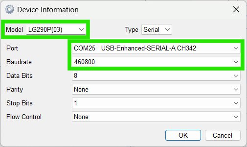
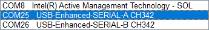
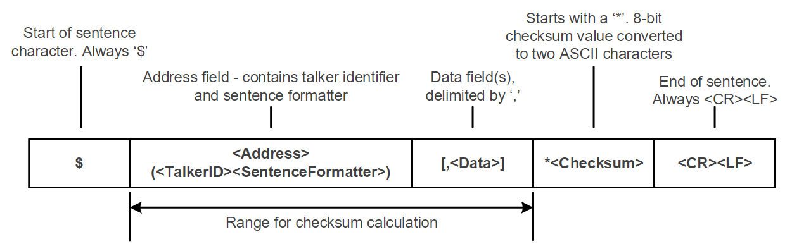
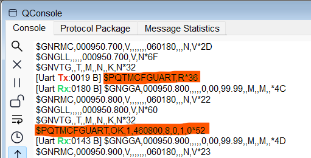
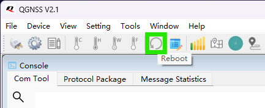
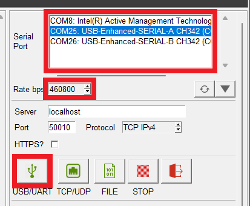
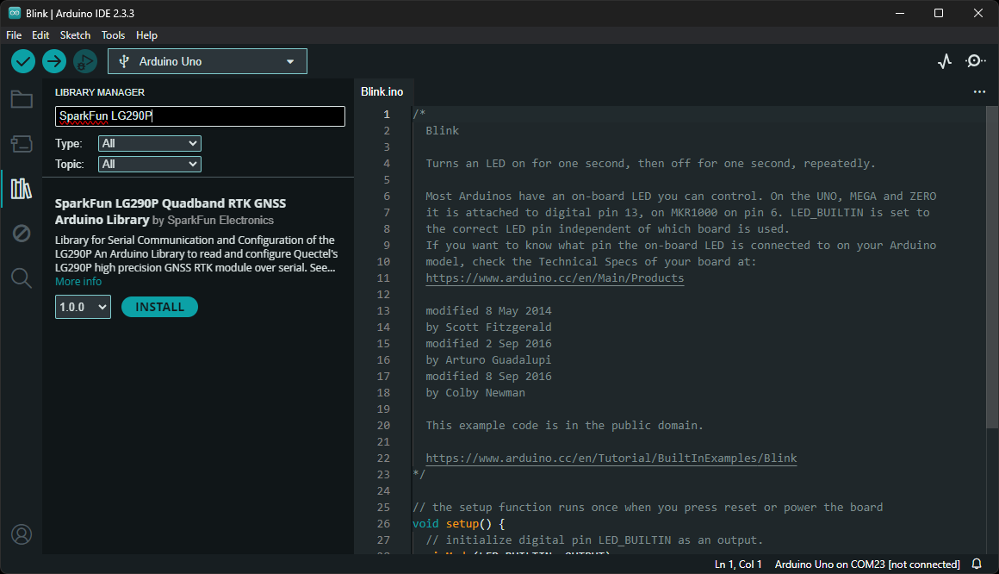

## CH342 USB Driver
The USB drivers for the CH342 USB-to-Serial converter can be downloaded from the [manufacturer's website](https://www.wch-ic.com/search?q=CH342&t=downloads).

<div class="grid cards" align="center" markdown>

-   :material-microsoft-windows: **Windows**

	---

	[:octicons-download-16:{ .heart } Download Page for `CH343SER.EXE`](https://www.wch-ic.com/downloads/CH343SER_EXE.html){ .md-button .md-button--primary target="blank" }


-   :material-apple: **MacOS**

	---

	[:octicons-download-16:{ .heart } Download Page for `CH341SER_MAC.ZIP`](https://www.wch-ic.com/downloads/CH34XSER_MAC_ZIP.html){ .md-button .md-button--primary target="blank" }

</div>


!!! info "Linux"
	A USB driver is not required for Linux based operating systems.


## GNSS Software
!!! tip
	While it is not required, we highly recommend that users configure their LG290P GNSS module with the [QGNSS software provided by Quectel](#qgnss-software). This is due to the unique data structure of the UART command messages, utilized to configure the LG290P module.

	??? warning "Windows Only"
		Currently, the QGNSS software is only available for Windows operating systems.

	??? success "Windows, MacOS, or Linux"
		For users with computers that run on MacOS or Linux, we have found alternative software option for viewing the data from the NMEA messages. However, this GUI interface is currently limited to only receiving UART messages and cannot send messages to configure the LG290P module.

		- :material-github: [GitHub Repository](https://github.com/semuconsulting/PyGPSClient)
		- [Installation Instructions](https://github.com/semuconsulting/PyGPSClient?tab=readme-ov-file#installation)
		- [PyPI Project](https://pypi.org/project/pygpsclient/)


### QGNSS Software
!!! warning "Windows Only"
	Currently, the QGNSS software is only available for Windows operating systems.

QGNSS is highly intuitive GNSS evaluation software that is easy to use, personalized, and compatible with leading Quectel technologies. The software allows users to define or apply GNSS product configurations for specific use cases. Saving, restoring, or sharing configurations between different products and users is easy. The software supports product evaluation with a choice of views to observe static and dynamic behavior of the connected a Quectel GNSS receiver.

<article style="text-align: center;" markdown>
[:octicons-download-16:{ .heart } Download the QGNSS Software *(v2.x)* from Quectel](https://www.quectel.com/download/qgnss_v2-0_en/){ .md-button .md-button--primary target="blank" }
</article>

!!! info "System Requirements"
	**Operating System:** Windows


#### Connecting to the LG290P
In order to connect to the LG290P properly, users will need to specify the settings of the `UART1` port.

<figure markdown>
[{ width="400" }](./assets/img/hookup_guide/qgnss-uart_settings-button.png "Click to enlarge")
<figcaption markdown>
Click the <kbd>:material-cog:</kbd> button to configure the UART settings.
</figcaption>
</figure>

Before users can connect to the Quad-band GNSS RTK breakout board, they will need to specify the connection settings in QGNSS. Once configured, users can select the ++"OK"++ button and QGNSS will automatically attempt to connect to the GNSS module.

- Select the `LG290P(03)` from the drop-down menu to configure the `Model` of the GNSS module being connected.
- Below, is a list of the default settings for `UART` ports of the LG290P. These settings should be selected in the `Device Information` menu, unless configured differently.
- For the `Port`, select the port with the lowest enumeration of the CH342 or the port labeled with channel `A` from the drop-down menu.


<div class="grid" markdown>

<div markdown>

<figure markdown>
[{ width="400" }](./assets/img/hookup_guide/qgnss-uart_settings.png "Click to enlarge")
<figcaption markdown>
Specify the settings for the UART port in QGNSS.
</figcaption>
</figure>

</div>


<div markdown>

!!! info "LG290P - Default Settings"
	The UART ports of the LG290P GNSS module will have the following default configuration:

	- Baudrate: 460800bps
	- Data Bits: 8
	- Parity: No
	- Stop Bits: 1
	- Flow Control: None

</div>


<div markdown>

<figure markdown>
[{ width="400" }](./assets/img/hookup_guide/qgnss-uart_ports.png "Click to enlarge")
<figcaption markdown>
Available `COM`ports for the CH342. Select the lowest enumeration or the port labeled `A`.
</figcaption>
</figure>

</div>

</div>


#### Configure the LG290P
By default, the UART ports are configured to transmit and receive `NMEA 0183` and/or `RTCM 3.x` messages. These messages are generally used for transmitting PNT data; and providing or receiving RTK corrections, respectively. Quectel also implements a system of proprietary messages (`PQTM`) for users to configure the LG290P, following the data format of the `NMEA` protocol.

???+ terminal "Data Format - PQTM Messages"
	The expected structure of the data in the proprietary PQTM messages is shown below:

	<figure markdown>
	[{ width="600" }](./assets/img/hookup_guide/nmea_protocol.png "Click to enlarge")
	<figcaption markdown>
	The data structure of Quectel messages for the `NMEA` protocol.
	</figcaption>
	</figure>

	`<Checksum>`:

	- Checksum field follows the checksum delimiter character `*`.
	- Checksum is the 8-bit exclusive OR of all characters in the sentence, including `,` the field delimiter, between but not including the `$` and the `*` delimiters.

	`<CR>` & `<LF>`: Carriage return; followed by a new line

	- Depending on the terminal emulator, these may be options configured in the program settings.
	- Otherwise, users may need to add the `\r` and `\n` characters at the end of the message.

In the QGNSS software, users can click on the ++"Advance"++ button, at the bottom of the `QConsole` window, to configure the settings for the messages sent to the LG290P. Selecting `NMEA` and `CRLF` from the drop-down menu of the **Checksum Type** and **Suffix** options, will automatically calculate and append the `<checksum>` value, carriage return, and line follow to the end of the message entered in the **Data Input** field.

<figure markdown>
[{ width="600" }](./assets/img/hookup_guide/qgnss-message_settings.png "Click to enlarge")
<figcaption markdown>
The settings for the messages transmitted from the QConsole.
</figcaption>
</figure>


???+ tip "Display the QConsole Toolbar"
	There is a toolbar for the QConsole, which has a bunch of tools that users may find useful. This includes, a search function, scroll-lock button, pause/clear the message feed, etc. To open/close the toolbar inside the QConsole, ++"right-click"++ on the mouse and select the `Show Tool` option from the drop-down menu or utilize the keyboard shortcut: ++ctrl++ + ++q++.

	<figure markdown>
	[{ width="400" }](./assets/img/hookup_guide/qgnss-toolbar.gif "Click to enlarge")
	<figcaption markdown>
	++"Right-click"++ on the mouse and select the `Show Tool` option, inside the QConsole.
	</figcaption>
	</figure>

??? example "Example - `PQTMCFGUART` Message"
	As an example, try utilizing the `PQTMCFGUART` PQTM message. Enter `$PQTMCFGUART,R*` into the **Data Input*** field of the QConsole. DOn't forget to select the `NMEA` and `CRLF` options from ++"Advance"++ settings menu. If entered and configured properly, the value `36` should pop up in the **Checksum** field of the QConsole; then, click on the <kbd>:material-send:</kbd> button to send the message.

	``` bash
	$PQTMCFGUART,R*
	```

	Once the message has been sent, keep a close watch of the messages in the console. It may help to click on the <kbd>:octicons-unlock-16:</kbd> button to disable auto-scrolling, when trying to locate the message response. Additionally, the response may not appear right away, it could be appended to the end of the next data packet, as shown in the image below.

	<figure markdown>
	[{ width="400" }](./assets/img/hookup_guide/qgnss-pqtm_message.png "Click to enlarge")
	<figcaption markdown>
	Example of utilizing the Quectel PQTM messages in the QConsole.
	</figcaption>
	</figure>


#### Firmware Update
In the event that users need to update the firmware on the LG290P module, please refer to the instructions in Quectel's [reference manual](./assets/component_documentation/quectel_lg290p03_firmware_upgrade_guide_v1-0.pdf). For the latest firmware, users should reach out to Quectel through their [forum page](https://forums.quectel.com/); otherwise, we have some of the firmware releases available in one of our [GitHub repositories](https://github.com/sparkfun/SparkFun_RTK_Postcard/tree/main/Firmware).


<article style="text-align: center;" markdown>

[Archived Firmware Releases](https://github.com/sparkfun/SparkFun_RTK_Postcard/tree/main/Firmware){ .md-button .md-button--primary target="blank" } [Firmware Upgrade Manual](./assets/component_documentation/quectel_lg290p03_firmware_upgrade_guide_v1-0.pdf){ .md-button .md-button--primary target="blank" }

</article>


!!! warning "Synchronization Step"
	In the [reference manual](./assets/component_documentation/quectel_lg290p03_firmware_upgrade_guide_v1-0.pdf), **Step 9** instructs users to wait for a synchronization process. If users refer to an earlier section of the manual, this process requires the LG290P module to receive a `SYNC_WORD1` within 500ms of powering up. Therefore, users must restart the module during the synchronization step. In the QGNSS software *(+v2.1)*, this can be performed with the reboot button.


	<figure markdown>
	[{ width="400" }](./assets/img/hookup_guide/qgnss-reboot_button.png "Click to enlarge")
	<figcaption markdown>Reboot button in the QGNSS software *(v2.1)*.</figcaption>
	</figure>


	!!! tip
		For previous versions of the QGNSS software, prior to initializing the firmware upgrade process, users can send the `PQTMSRR` message to perform a system reset and reboot the GNSS receiver. We recommend having everything pre-configured to upgrade the firmware as the module usually initializes within 5s of sending the `PQTMSRR` message.


### PyGPSClient
As an alternative to QGNSS, for users with computers that run on MacOS or Linux (_including Raspberry Pi_), we recommend [PyGPSClient](https://github.com/semuconsulting/PyGPSClient) as an option for configuring the LG290P (_via proprietary NMEA sentences_), viewing standard and proprietary NMEA data from the receiver and connecting to an NTRIP caster.


??? info "Resources"
	For additional information, users can refer to the following resources for the PyGPSClient software:

	- :material-github: [GitHub Repository](https://github.com/semuconsulting/PyGPSClient)
	- [Installation Instructions](https://github.com/semuconsulting/PyGPSClient?tab=readme-ov-file#installation)
	- [LG290P Configuration](https://github.com/semuconsulting/PyGPSClient?tab=readme-ov-file#nmeaconfig)
	- [PyPI Project](https://pypi.org/project/pygpsclient/)


#### Installation
There are a variety of [installation methods](https://github.com/semuconsulting/PyGPSClient?tab=readme-ov-file#installation) detailed in the GitHub repository's `README.md` file. However, we recommend utilizing the `pip` installation method.


!!! terminal "Installation Commands"
	Depending on how Python is installed on the computer, one of the following commands should allow users to install the software.

	- 
		``` bash
		python3 -m pip install --upgrade pygpsclient
		```
	- 
		``` bash
		pip install --upgrade pygpsclient
		```


	!!! info "System Requirements"
		This installation method requires an internet connection. Additionally, users may need administrative privileges *(or root access `sudo`)* for some installations.


#### Connecting to the LG290P
Before users can connect to the Quad-band GNSS RTK breakout board, they will need to specify the settings of the UART port in PyGPSClient. Once configured, users can select the <kbd>:material-usb:</kbd> button and PyGPSClient will automatically attempt to connect to the GNSS module. If the UART port does not appear in the Serial Port list in the PyGPSClient UI, it can be added as a user-defined port e.g. `/dev/ttyAMA0`.

- Below, is a list of the default settings for `UART` ports of the LG290P. These settings should be selected in the configuration menu.
- For the `Serial Port`, select the port with the lowest enumeration of the CH342 or the port labeled with channel `A` from the drop-down menu.


<div class="grid" markdown>

<div markdown>

<figure markdown>
[{ width="400" }](./assets/img/hookup_guide/pygpsclient-uart_settings-small.png "Click to enlarge")
<figcaption markdown>
Specify the settings for the UART port in QGNSS.
</figcaption>
</figure>

</div>


<div markdown>

!!! info "LG290P - Default Settings"
	The UART ports of the LG290P GNSS module will have the following default configuration:

	- Baudrate: 460800bps
	- Data Bits: 8
	- Parity: No
	- Stop Bits: 1
	- Flow Control: None

</div>

</div>


### Terminal Emulator
Another viable option for connecting to the Quad-band GNSS RTK breakout board, is to utilize a [terminal emulation program](https://learn.sparkfun.com/tutorials/112). While reading the data sent from the LG290P is relatively trivial, users will need to be more selective when choosing an emulator to configure the LG290P module on the Quad-band GNSS RTK breakout board. This is due to the unique data structure of the proprietary messages that Quectel implements to configure the LG290P *(see the [**Configure the LG290P**](#configure-the-lg290p) section, above)*.


## Arduino IDE
!!! tip
	For first-time users, who have never programmed before and are looking to use the Arduino IDE, we recommend beginning with the <a href="https://www.sparkfun.com/products/15631">SparkFun Inventor's Kit (SIK)</a>, which is designed to help users get started programming with the Arduino IDE.

Most users may already be familiar with the Arduino IDE and its use. However, for those of you who have never heard the name *Arduino* before, feel free to check out the [Arduino website](https://www.arduino.cc/en/Guide/HomePage). To get started with using the Arduino IDE, check out our tutorials below:


<div class="grid cards" markdown align="center">

-   <a href="https://learn.sparkfun.com/tutorials/50"><figure markdown>
	
	</figure>

	---

	**What is an Arduino?**</a>

-   <a href="https://learn.sparkfun.com/tutorials/61"><figure markdown>
	
	</figure>

	---
	
	**Installing the Arduino IDE**</a>

-   <a href="https://learn.sparkfun.com/tutorials/15"><figure markdown>
	
	</figure>

	---
	
	**Installing an Arduino Library**</a>

-   <a href="https://learn.sparkfun.com/tutorials/1265"><figure markdown>
	
	</figure>

	---
	
	**Installing Board Definitions in the Arduino IDE**</a>
</div>


### SparkFun LG290P Quadband RTK GNSS Arduino Library
The [SparkFun LG290P Quadband RTK GNSS Arduino Library](https://github.com/sparkfun/SparkFun_LG290P_GNSS_Arduino_Library) can be installed from the library manager in the Arduino IDE by searching for:

	SparkFun LG290P Quadband RTK GNSS Arduino Library

<div class="grid" markdown>

<div markdown>

<figure markdown>
[{ width="400" }](./assets/img/hookup_guide/arduino_library.png)
<figcaption markdown>
SparkFun LG290P Quadband RTK GNSS Arduino Library in the library manager of the Arduino IDE.
</figcaption>
</figure>

</div>


<div markdown>

!!! tip "Manually Download the Arduino Library"
	For users who would like to manually download and install the library, the `*.zip` file can be accessed from the [GitHub repository](https://github.com/sparkfun/SparkFun_LG290P_GNSS_Arduino_Library) or downloaded by clicking the button below.

	<article style="text-align: center;" markdown>
	[:octicons-download-16:{ .heart } Download the Arduino Library](https://github.com/sparkfun/SparkFun_LG290P_GNSS_Arduino_Library/archive/refs/heads/main.zip){ .md-button .md-button--primary }
	</article>

</div>

</div>
